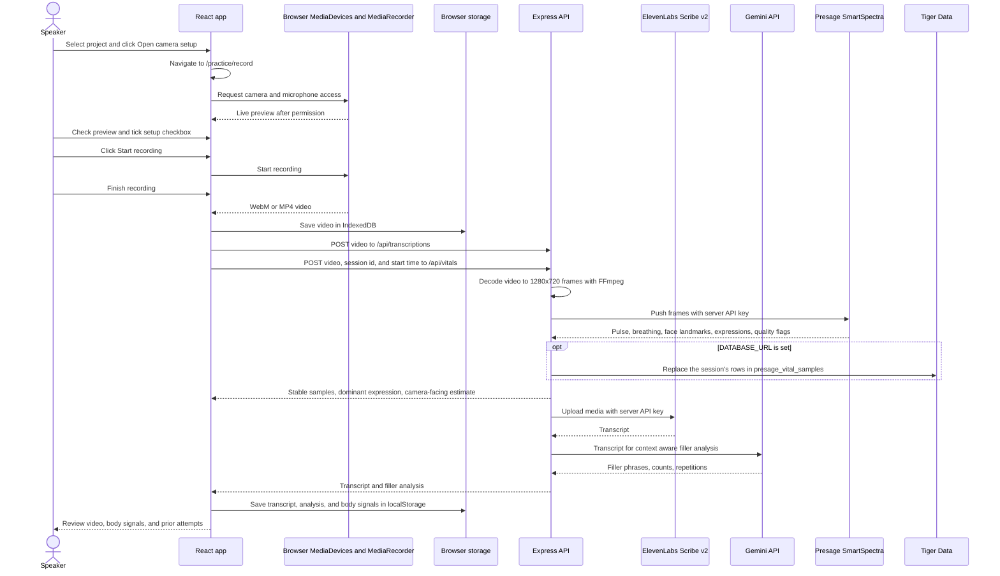

# PrepTalk

PrepTalk helps you rehearse a presentation, pitch, or interview answer. The React app records video in the browser, sends it to the Express backend for an ElevenLabs Scribe v2 transcript and Presage SmartSpectra body signals, then sends the transcript to Gemini for context aware filler word and repeated word analysis. Recordings and session details stay in the browser on the device used to record. When `DATABASE_URL` is set, the backend also saves each run's Presage body signals to Tiger Data.

## Run locally

Use Node.js 24 or newer. From the `PrepTalk` directory:

```sh
npm ci
npm run dev
```

If you do not already have a root `.env`, copy `.env.example` to `.env`. Add `ELEVENLABS_API_KEY`, `GEMINI_API_KEY`, and `SMARTSPECTRA_API_KEY` before starting the servers. Open `http://localhost:5173`. The backend listens on port 4000; Vite forwards `/api` requests to it. Keep the keys in the root `.env` file, which the backend loads at startup. Restart the backend after changing it. Keys are never needed in frontend environment variables. `GEMINI_MODEL` defaults to `gemini-3.5-flash-lite`.

To save Presage body signals to Tiger Data, set `DATABASE_URL` in `.env` to your Tiger service's connection string (Tiger Console > your service > Connect) and apply the migrations, including the new validation columns:

```sh
npm run db:migrate
```

At startup the backend logs whether it can save to Tiger Data.

Choose **Practice studio**, select a project, name a run, and click **Open camera setup**. The app moves to `/practice/record` and opens a recording popout. It requests camera and microphone access for a live preview. Use the live preview to check your face, upper chest, and lighting. Tick the setup checkbox to enable **Start recording**, then click it when ready. This is a user check; Presage analyzes the completed run afterward. Click **Finish recording** to save the video and open its review. Transcription and Presage analysis run independently in the background. If either fails, the video is still saved locally; retry each step from the review. Browser speech recognition supplies a live preview where supported. Editing a transcript clears its old Gemini result so it can be analyzed again. Keep later runs in the same project to compare attempts. The red, yellow, and green progress bar compares the current practice estimate with the previous attempt. Use the top bar to switch between light and dark blue themes.

## Run on another machine with Docker

Install Docker Engine or Docker Desktop with Compose on the host machine. Set `DEV_HOST` in `.env` to the DNS name or LAN IP that browsers will use to reach the host. Add `ELEVENLABS_API_KEY`, `GEMINI_API_KEY`, and `SMARTSPECTRA_API_KEY`, then run:

```sh
docker compose up --build
```

Open `https://<DEV_HOST>` from another machine. Caddy serves the frontend and API on the same HTTPS origin and forwards Vite's development connection. Ports 80 and 443 on the host must be reachable from client machines. If using a public DNS name, point it at the server so Caddy can obtain a trusted certificate. For a LAN IP or private hostname, Caddy uses a local certificate authority; trust its root certificate on each client device before using the camera. Export it with:

```sh
docker compose cp proxy:/data/caddy/pki/authorities/local/root.crt ./preptalk-root.crt
```

Trust `preptalk-root.crt` using each client's operating system or browser certificate settings. Keep this server on a trusted network while developing: the current app has no account login or access control for the transcription endpoint. Docker also starts a TimescaleDB container. The backend saves Presage body signals to it; create the table once with `docker compose exec app npm run db:migrate`. Sessions and videos are not written to it. `docker compose down` stops the containers while retaining the database volume.

The host's direct `http://<LAN-IP>:5173` URL cannot request camera access in most browsers because camera access requires a secure context. Use the HTTPS URL above, or `http://localhost:5173` when working on the host itself.

## Vercel preview

Vercel serves the frontend and runs the API as a single function (`api/index.ts`, routed by `vercel.json`). It can't analyze recordings: Vercel rejects request bodies over about 4 MB, which most runs exceed, and Presage's native SDK can't run in its functions, so `/api/vitals` answers 501 there. Short runs can still be transcribed. Use `npm run dev` for full analysis; a hosted version needs the backend on a host without these limits, such as the Docker image above.

## Current recording flow



The dashboard charts speaking pace across saved sessions. Videos can be played, downloaded, or deleted together from Session history. The upload limit for transcription and Presage analysis is 50 MB each. Gemini uses the transcript for filler words and immediate repetitions; the app still has a basic local count when Gemini is unavailable. Presage runs on the backend using the native Node SDK and processes one recording at a time. The backend decodes each recording with the bundled FFmpeg (`ffmpeg-static`) and pushes its frames to the SDK, scaled to fit 1280x720: the SDK's own file reader can't open videos on Windows, and it misses faces in smaller frames. A fresh `npm ci` downloads FFmpeg because `package.json` approves `ffmpeg-static`'s install script (`allowScripts`). Temporary server video files are deleted after processing.

## Body signal limits

Presage provides pulse and breathing samples with confidence and stable flags. Review averages and charts include only stable samples with at least 60% measurement confidence. Pulse needs about 12 seconds and breathing about 30 seconds to warm up. Speaking, movement, low light, or hidden chest can reduce breathing quality. “Possible breath interruptions” counts large changes between adjacent reliable breathing-rate readings; it is a review cue, not an apnea diagnosis. The camera-facing percentage is a rough heuristic derived from face and iris landmarks, not a validated eye contact measurement. Interview mode targets more camera-facing time than presentation mode; presentations allow looking at notes or different parts of an audience.

Breathing is the hardest signal to get. Presage measures it from chest movement, so it needs a run of at least 30 seconds with the upper chest in view, and it rarely reaches 60% confidence while someone is talking. Head-and-shoulders framing usually yields no reliable breathing rate; the review then says why (run too short, or the best confidence Presage reached).

The dominant facial expression is the one Presage scored highest (of angry, contempt, disgust, fear, happy, neutral, sad, and surprise) for the most seconds of stable face data, shown with its share of the run and the next two. Like the camera-facing estimate, it describes the face, not what the speaker feels. Runs analyzed before this was added show it after **Reanalyze with Presage**.

The 0–100 overall confidence estimate combines available filler frequency, speaking pace, camera-facing time, and stable heart and breathing steadiness. Missing factors are omitted and the remaining weights are scaled. Red is below 50, yellow is 50–74, and green is 75 or above. It is a rehearsal aid, not a measure of a person's internal confidence. User login, saving sessions and videos to Tiger Data, and broader Gemini coaching are still future work.

## Tiger Data

With `DATABASE_URL` set, each Presage analysis is saved to the `presage_vital_samples` hypertable ([backend/db/migrations](backend/db/migrations/)): one row for every second of the recording, including warm-up seconds with null rate values, with heart and breathing rate, confidence, stable flags, Presage validation code and hint, and the second's average expression scores (`expression_scores`, a list of `{name, type, confidence}`). `recorded_at` is the run's start time plus `elapsed_seconds`. Analyzing a run again replaces its rows. Presage rates of 0 are stored as `NULL`. If saving fails, the review still shows the analysis and the backend logs a `[tigerdata]` error.

Tiger Console shows timestamps in UTC. The latest runs:

```sql
SELECT session_id, count(*) AS samples, min(recorded_at) AS first_sample, max(recorded_at) AS last_sample
FROM presage_vital_samples
GROUP BY session_id
ORDER BY first_sample DESC
LIMIT 10;
```

## Checks

```sh
npm run build
npm run lint
npm run format:check
npm test
```
