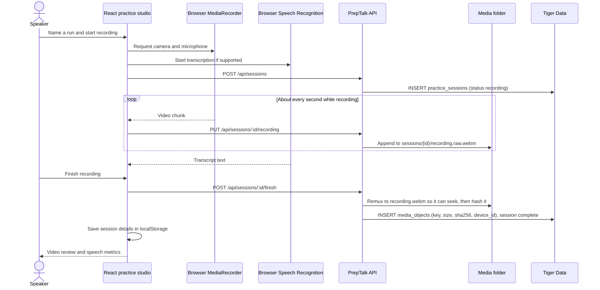
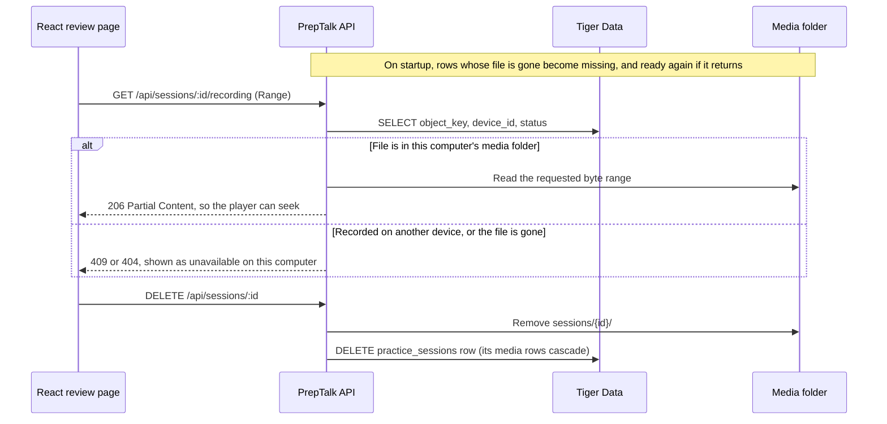
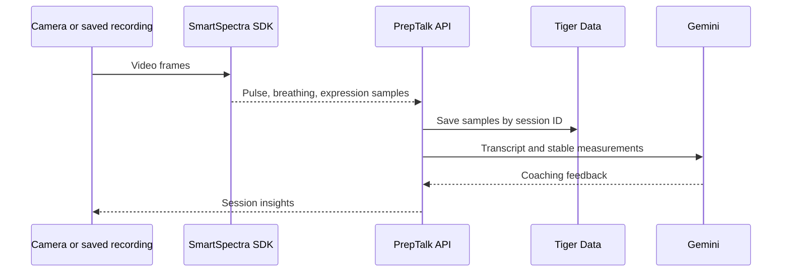

# PrepTalk

A presentation practice front end built with React, TypeScript, and Vite. Record a presentation, interview answer, or pitch, then review the video, transcript, speaking pace, and filler words. Session details are saved in **this browser**; videos are saved on this computer, outside the repo, and indexed in Tiger Data.

## Run locally

Requires Node.js 24 or newer.

```sh
npm install
cp .env.example .env   # then set DATABASE_URL to your Tiger Data connection string
npm run db:migrate     # once, to create the tables
npm run dev
```

Open the Vite URL shown in the terminal (usually `http://localhost:5173`). The Express backend runs on port 4000 and stores recordings; without `DATABASE_URL` it still starts, but videos aren't saved. For the front end alone, use `npm run dev -w frontend`.

Camera and microphone access works on `localhost` or HTTPS. Live transcription uses the browser Speech Recognition API when available. You can paste or correct a transcript from a saved session and recalculate its speech metrics.

## Current flow



The dashboard uses saved sessions to chart speaking pace. Videos can be played, downloaded, or deleted. No sample user data or simulated vitals are shown.

## Recording storage

Videos never go in the repo or in Tiger Data. The backend writes them to a per-user media folder, the same in development and production:

| OS      | Media folder                                               |
| ------- | ---------------------------------------------------------- |
| Windows | `%LOCALAPPDATA%\PrepTalk\media`                            |
| macOS   | `~/Library/Application Support/PrepTalk/media`             |
| Linux   | `$XDG_DATA_HOME/PrepTalk/media` (default `~/.local/share`) |

Set `PREPTALK_MEDIA_DIR` in `.env` to use another folder. Under Docker Compose, videos go in the `media_data` volume; create the tables with `docker compose exec app npm run db:migrate`.

Tiger Data's `media_objects` table stores each video's relative key (`sessions/<uuid>/recording.webm`), size, SHA-256, duration, and the `device_id` of the media folder that holds it (from that folder's `device.json`). A key reads the same on Windows and macOS, and moving the repo doesn't break it. The schema is in [`backend/db/migrations`](backend/db/migrations).



## Integration plan

The Hackathon `presage-playground/metric-points.cjs` normalizer was adapted into [`frontend/src/utils/presageMetrics.ts`](frontend/src/utils/presageMetrics.ts). It preserves timestamp, confidence, and stable status for pulse, breathing, and expression samples. The playground's Electron bridge and Tiger Data prototype require additional source files and a server integration; they are not connected to this browser UI.



Planned body signals include pulse (~12-second warm-up), breathing (~30 seconds), HRV (~60 seconds), breathing and relative arterial-pressure waveforms, expression, confidence scores (0–100), and stability flags. The browser UI labels these as planned. Auth0/Google login, Gemini coaching, ElevenLabs, and saving Presage samples to Tiger Data are also still integration work. Use a server-side credential or supported OAuth flow for Presage; do not put an API key in Vite client environment variables.

## Checks

```sh
npm run build
npm run lint
npm test
```
