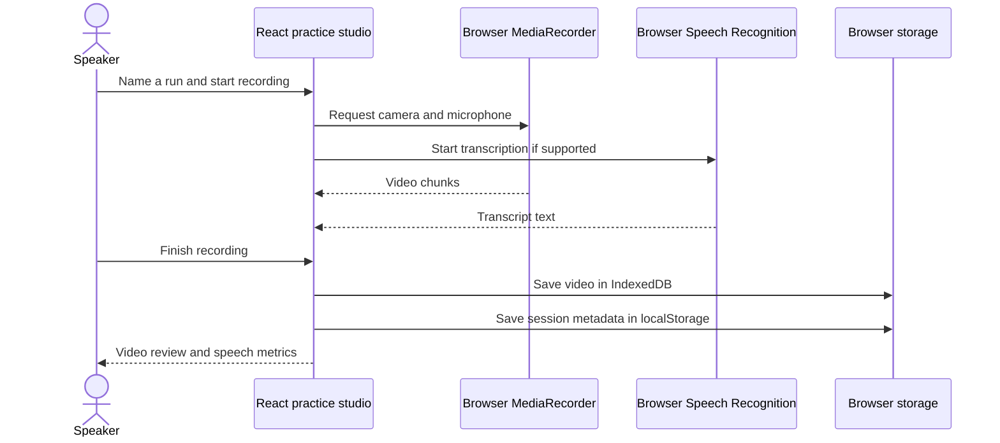
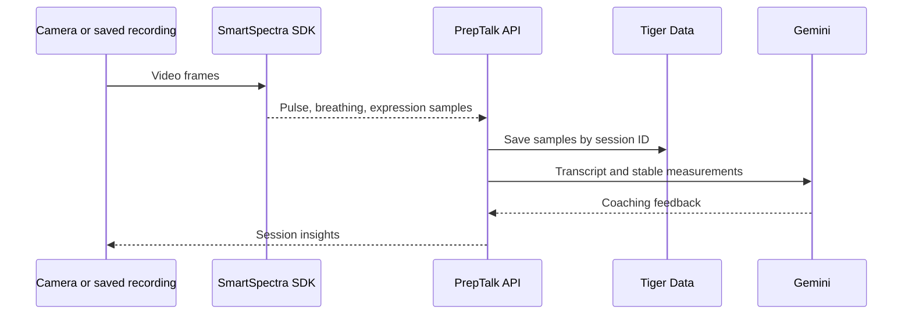

# PrepTalk

A presentation practice front end built with React, TypeScript, and Vite. Record a presentation, interview answer, or pitch, then review the video, transcript, speaking pace, and filler words. Sessions are saved in **this browser** for now.

## Run locally

Requires Node.js 24 or newer.

```sh
npm install
npm run dev
```

Open the Vite URL shown in the terminal (usually `http://localhost:5173`). The Express skeleton runs on port 4000. For the front end alone, use `npm run dev -w frontend`.

Camera and microphone access works on `localhost` or HTTPS. Live transcription uses the browser Speech Recognition API when available. You can paste or correct a transcript from a saved session and recalculate its speech metrics.

## Current flow



The dashboard uses saved sessions to chart speaking pace. Videos can be played, downloaded, or deleted. No sample user data or simulated vitals are shown.

## Integration plan

The Hackathon `presage-playground/metric-points.cjs` normalizer was adapted into [`frontend/src/utils/presageMetrics.ts`](frontend/src/utils/presageMetrics.ts). It preserves timestamp, confidence, and stable status for pulse, breathing, and expression samples. The playground's Electron bridge and Tiger Data prototype require additional source files and a server integration; they are not connected to this browser UI.



Planned body signals include pulse (~12-second warm-up), breathing (~30 seconds), HRV (~60 seconds), waveforms, expression, confidence scores, and stability flags. The browser UI labels these as planned. Auth0/Google login, Gemini coaching, ElevenLabs, and Tiger Data persistence are also still integration work. The current Express route returns a placeholder session ID and does not store a recording. Use a server-side credential or supported OAuth flow for Presage; do not put an API key in Vite client environment variables.

## Checks

```sh
npm run build
npm run lint
npm test
```
