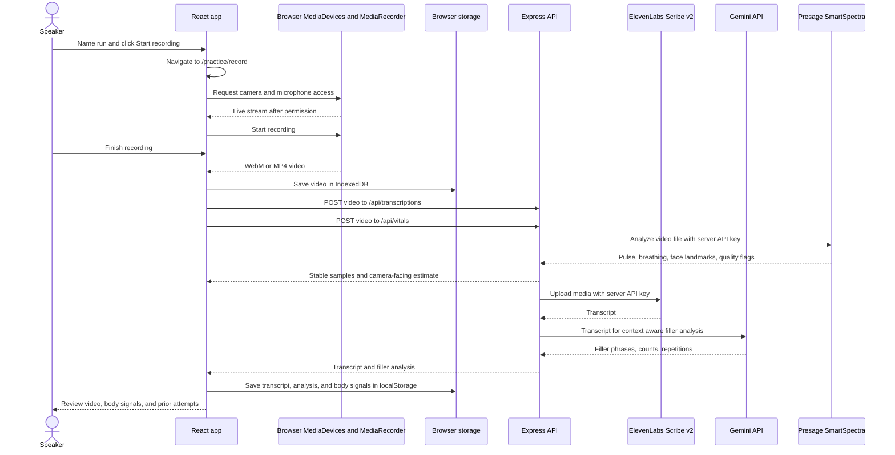

# PrepTalk

PrepTalk helps you rehearse a presentation, pitch, or interview answer. The React app records video in the browser, sends it to the Express backend for an ElevenLabs Scribe v2 transcript and Presage SmartSpectra body signals, then sends the transcript to Gemini for context aware filler word and repeated word analysis. Recordings and session details currently stay in the browser on the device used to record.

## Run locally

Use Node.js 24 or newer. From the `PrepTalk` directory:

```sh
npm ci
npm run dev
```

If you do not already have a root `.env`, copy `.env.example` to `.env`. Add `ELEVENLABS_API_KEY`, `GEMINI_API_KEY`, and `SMARTSPECTRA_API_KEY` before starting the servers. Open `http://localhost:5173`. The backend listens on port 4000; Vite forwards `/api` requests to it. Keep the keys in the root `.env` file, which the backend loads at startup. Restart the backend after changing it. Keys are never needed in frontend environment variables. `GEMINI_MODEL` defaults to `gemini-3.5-flash-lite`.

Choose **Practice studio**, name a run, and click **Start recording**. The app moves to `/practice/record` and opens a recording popout that uses 96% of the desktop viewport. Its large camera preview includes a visual guide for keeping your head and upper chest in frame; the guide does not detect body position. The browser requests camera and microphone permission, then starts recording after permission is granted. Click **Finish recording** to save the video and open its review. Transcription and Presage analysis run independently in the background. If either fails, the video is still saved locally; retry each step from the review. Browser speech recognition supplies a live preview where supported. Editing a transcript clears its old Gemini result so it can be analyzed again. Use the same practice name and type on later runs to compare attempts. The red, yellow, and green progress bar compares the current practice estimate with the previous attempt. Use the top bar to switch between light and dark blue themes.

## Run on another machine with Docker

Install Docker Engine or Docker Desktop with Compose on the host machine. Set `DEV_HOST` in `.env` to the DNS name or LAN IP that browsers will use to reach the host. Add `ELEVENLABS_API_KEY`, `GEMINI_API_KEY`, and `SMARTSPECTRA_API_KEY`, then run:

```sh
docker compose up --build
```

Open `https://<DEV_HOST>` from another machine. Caddy serves the frontend and API on the same HTTPS origin and forwards Vite's development connection. Ports 80 and 443 on the host must be reachable from client machines. If using a public DNS name, point it at the server so Caddy can obtain a trusted certificate. For a LAN IP or private hostname, Caddy uses a local certificate authority; trust its root certificate on each client device before using the camera. Export it with:

```sh
docker compose cp proxy:/data/caddy/pki/authorities/local/root.crt ./preptalk-root.crt
```

Trust `preptalk-root.crt` using each client's operating system or browser certificate settings. Keep this server on a trusted network while developing: the current app has no account login or access control for the transcription endpoint. Docker also starts a TimescaleDB container for future persistence; the current app does not write sessions or videos to it. `docker compose down` stops the containers while retaining the database volume.

The host's direct `http://<LAN-IP>:5173` URL cannot request camera access in most browsers because camera access requires a secure context. Use the HTTPS URL above, or `http://localhost:5173` when working on the host itself.

## Current recording flow



The dashboard charts speaking pace across saved sessions. Videos can be played, downloaded, or deleted. The upload limit for transcription and Presage analysis is 50 MB each. Gemini uses the transcript for filler words and immediate repetitions; the app still has a basic local count when Gemini is unavailable. Presage runs on the backend using the native Node SDK and processes one recording at a time. Temporary server video files are deleted after processing.

## Body signal limits

Presage provides pulse and breathing samples with confidence and stable flags. Review averages and charts include only stable samples with at least 60% measurement confidence. Pulse needs about 12 seconds and breathing about 30 seconds to warm up. Speaking, movement, low light, or hidden chest can reduce breathing quality. “Possible breath interruptions” counts large changes between adjacent reliable breathing-rate readings; it is a review cue, not an apnea diagnosis. The camera-facing percentage is a rough heuristic derived from face and iris landmarks, not a validated eye contact measurement. Interview mode targets more camera-facing time than presentation mode; presentations allow looking at notes or different parts of an audience.

The 0–100 overall confidence estimate combines available filler frequency, speaking pace, camera-facing time, and stable heart and breathing steadiness. Missing factors are omitted and the remaining weights are scaled. Red is below 50, yellow is 50–74, and green is 75 or above. It is a rehearsal aid, not a measure of a person's internal confidence. User login, Tiger Data persistence, and broader Gemini coaching are still future work.

## Checks

```sh
npm run build
npm run lint
npm run format:check
npm test
```
